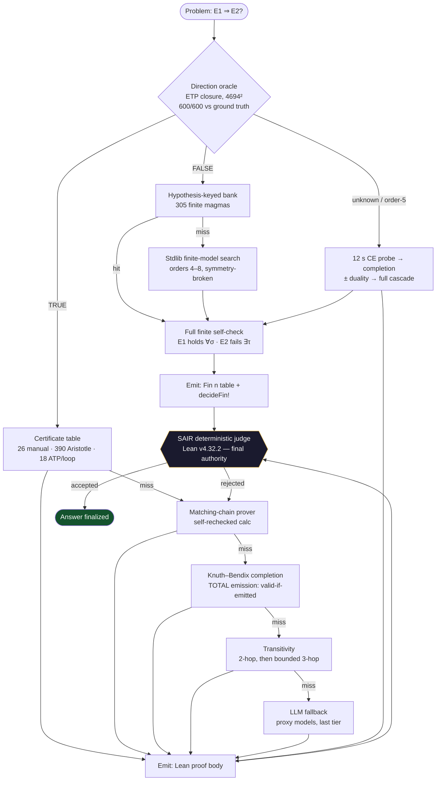
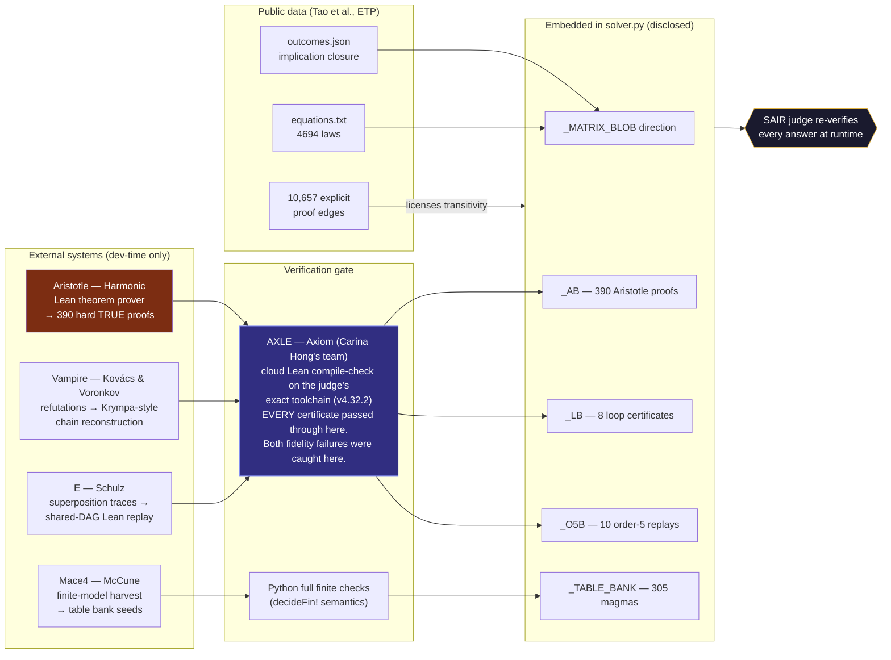

# EULER — Workflow Diagrams

Two views of the system. The first is what happens **at runtime, per
problem, inside the sandbox**. The second is the **dev-time ecosystem** —
where the external systems (Axiom's Axle, Harmonic's Aristotle, the ATPs)
sit, what each contributed, and the invariant that nothing enters the solver
without independent re-verification. Interactive versions of both live on
the Riemann Labs page (`/euler`).

---

## 1. Runtime: one problem through the solver

Everything left of the judge is EULER; the judge is the competition's.
Every path ends at an independent check — there is no unverified exit.

**Reading it:** the oracle is exact on order-4, so almost every problem takes
one clean branch. The dashed reality behind "miss → next tier" is
cheapest-first: table lookups in microseconds, search in seconds, the LLM
only if everything deterministic has failed — and even then, only the judge's
`accepted` finalizes.

---

## 2. Dev-time: the ecosystem that built the certificates

Nothing on the left is called at runtime. Only re-verified *outputs* are
embedded, and the judge re-checks every one again at answer time.

**The invariant this diagram encodes:** external provers *propose*; the
verification gate *disposes*; the competition judge disposes **again**. An
Aristotle proof, a Vampire reconstruction, and a hand-written lemma all
enter the solver through exactly the same door — a judge-exact compile
check — and exit through exactly the same door at answer time. Trust is
never transferred; it is re-established at every boundary.

---

## Acknowledgment of the systems named here

- **Axle — Axiom (Carina Hong and the Axiom Math team).** The dev-time
  verification backbone of this project: judge-exact Lean compile checks in
  ~2 seconds instead of a ~40-minute playground round trip. Every
  certificate in this pack passed through Axle before it was embedded, and
  both statement-fidelity failures on our record were *discovered* as Axle
  divergences. The measurement discipline this pack is built on would have
  been impractical without it.
- **Aristotle — Harmonic.** Proved 390 of the solver's hard TRUE
  implications during earlier development campaigns; those kernel-checked
  bodies are embedded and disclosed as the Layer-1 certificate table
  (`_AB`), and the judge re-verifies each at answer time.
- Vampire (Kovács & Voronkov), E (Schulz), Mace4 (McCune): the classical
  ATP/model-finding stack whose outputs the reconstruction pipeline replays
  into human-checkable Lean.
